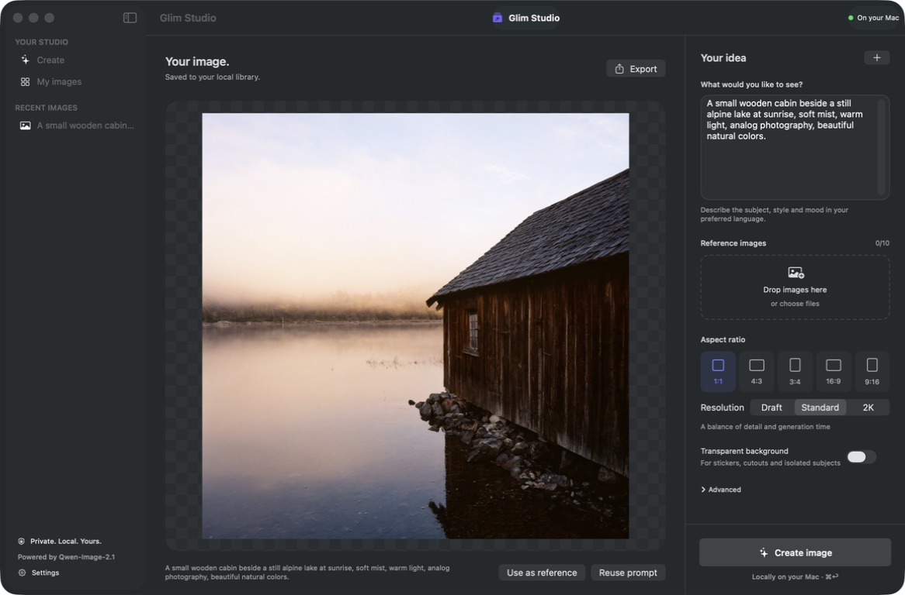
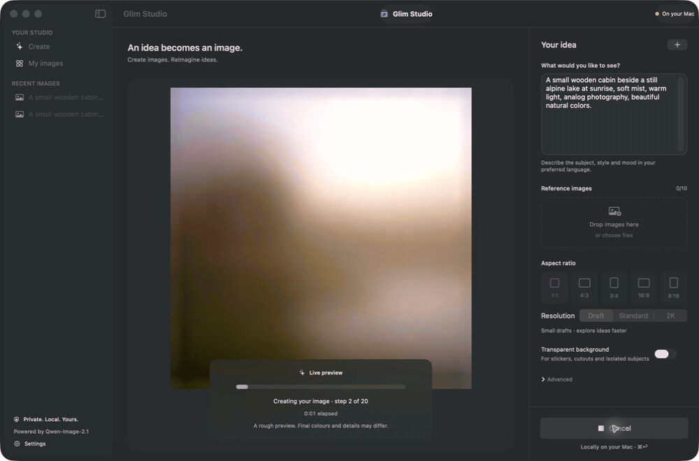
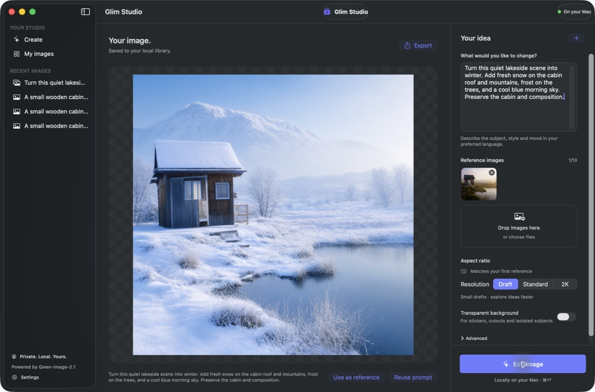

<div align="center">

# Glim Studio
### A little idea. A whole new image.

A native Mac studio for creating and editing images — privately, on your own Apple Silicon.

[Download for Mac](https://github.com/sthamann/glim-studio/releases/latest) · [How it works](#from-prompt-to-picture) · [Performance](docs/performance.md) · [Build from source](#build-from-source)




</div>

## Watch an idea appear



*Time-compressed capture of a real local generation. The pixelated frames come from the model as it works; the final image replaces them when decoding finishes. Preview colours and details are approximate.*

## From prompt to picture

1. **Open Glim Studio.** It chooses a model for your Mac and downloads it automatically. The first setup needs internet and a substantial download; interrupted model downloads resume.
2. **Describe your idea.** Choose a shape, a resolution, and optionally a transparent background. English is the interface default; prompts can use your preferred language.
3. **Watch it emerge.** A real live preview appears after the first sampling step. There is no preview during initial model loading or prompt encoding.
4. **Make it yours.** Drop in reference images, describe a change, and export a PNG. Your creations stay in your local library.

No inference account, API key, or cloud GPU is required. The app contacts GitHub for update checks and downloads model/runtime files during setup. Prompts, references and generated images are processed locally.

## Made for making

- **Create and edit** with Qwen-Image-2.1.
- **Live pixel previews** that follow the actual denoising process.
- **Optional Fast mode** under Advanced, reusing intermediate results. Experimental: fine details and lettering can change; keep it off for final-quality work.
- **Reference images** — up to ten inputs, with numbered references and multiple selection in My images.
- **Apple Photos picker** in My images and the editor. Choose several photos at once; the app receives only your selected items. iCloud-only originals may first need downloading by Photos.
- **Transparent PNGs** for stickers and isolated subjects.
- **Draft, Standard and 2K** resolutions, seven aspect ratios and 15 social/business format presets.
- **Copy, Save as, Print and Use as reference** directly from your finished image; keyboard shortcuts and library context menus included.
- **Local history**, prompt reuse and cancellation. Create starts with an empty canvas.

### Ready for where your image goes

Choose a **Format preset** for X profile headers/pictures and article covers; LinkedIn profile banners/pictures, company covers, article/newsletter covers and link posts; social square/portrait/story layouts; or presentations, website heroes, products and A4 covers. The saved PNG has the preset's exact dimensions. Drafts render smaller and are resized; select 2K for more generated detail. A small center crop reconciles the model grid with the output ratio. Reference edits continue to follow the first reference's shape.

The X article cover is a suggested 5:2 layout, not an officially verified X requirement. Platform crops and overlays can vary. See [preset dimensions and sources](docs/formats.md).
- **Secure app updates** using Sparkle, signed archives and signed update feeds. Use **Glim Studio → Check for Updates…**.



## Picked for your Mac

| Your Mac | Automatic model | Initial model download | Starting preset |
|---|---|---:|---|
| Apple Silicon, 48 GB RAM or more | BF16, full precision | 32.4 GB | Standard, 40 steps |
| Apple Silicon, 32–47 GB RAM | INT8, compact | 17.3 GB | Standard, 40 steps |
| Apple Silicon, 24–31 GB RAM | INT8, compact | 17.3 GB | Draft, 20 steps |
| Apple Silicon, 16–23 GB RAM | INT8, experimental | 17.3 GB | Draft, 20 steps |
| 8 GB RAM or Intel | Not supported | — | — |

Allow additional disk space for Python, dependencies, temporary downloads and your images. **24 GB or more is recommended, not yet a measured MacBook guarantee.** Current real-world measurements are from an M3 Ultra Mac Studio with 512 GB RAM. A compact 1024² test reached approximately 13.8 GiB of process physical footprint, before allowing for macOS and other apps. 16 GB machines may swap heavily.

Below 32 GB, Glim releases cached models after saving each finished image. This frees memory between jobs; it does not reduce the generation peak. The next image may take longer to start.

### Honest performance

On that M3 Ultra, a 1024² image with 40 steps took **124.6 seconds with the current MPS engine** and **122.7 seconds with an experimental MLX backend**. These are single runs, not a statistically significant MLX win. Drafts are substantially quicker; fewer steps trade refinement for speed. See [measurements, limitations and next optimizations](docs/performance.md).

The app ships the tested MPS engine. The experimental MLX comparison is included for research; it is not the production engine.

A new sequential 4-bit MLX research probe completed 512² and 1024² images with **5.62 and 5.79 GiB** peak process physical footprint, including loading, on the M3 Ultra. This is promising for smaller Macs, but is **not shipped as the app backend and not a real 8/16 GB hardware test**. See [small-Mac probes, limitations and reproduction](docs/small-macs.md).

## Install

Download the Apple Silicon ZIP from [Releases](https://github.com/sthamann/glim-studio/releases/latest), unzip it, move **Glim Studio.app** to Applications and open it. Model setup starts automatically. Models and your library live in Application Support, outside the app bundle, so updating the app keeps them intact.

**Early access signing:** builds are currently ad-hoc signed and have signed Sparkle update packages, but are **not yet Apple Developer ID signed or notarized**. macOS may block the initial downloaded app. If you choose to run this early-access build, use macOS **System Settings → Privacy & Security → Open Anyway** after reviewing the source and release. Do not disable Gatekeeper globally. Developer ID signing requires an active Apple Developer membership and distribution certificate.

## Build from source

Requires an Apple Silicon Mac, macOS 14+, a Swift 6 toolchain and [uv](https://docs.astral.sh/uv/). Building does not download the AI models; launching the app does.

```sh
git clone https://github.com/sthamann/glim-studio.git
cd glim-studio
./script/check.sh
./script/build_and_run.sh
```

The app is written to `outputs/Glim Studio.app`. Use `--build-only` to package without launching. Dependency versions and the ComfyUI revision are pinned; downloaded model files are checked against SHA-256 hashes.

### Releases and updates

Every push to `main` builds a downloadable macOS artifact. Pushing a version tag, such as `v0.1.0`, creates a GitHub Release containing the compiled app, checksums, and a signed Sparkle appcast. The tag must match `VERSION`. The signing key lives in the macOS Keychain and the repository's encrypted `SPARKLE_PRIVATE_KEY` Actions secret, never in source control. See [release operations](docs/releases.md).

### Architecture

SwiftUI interface → private loopback engine → PyTorch MPS → Apple GPU.

The bundled launcher runs a pinned ComfyUI subprocess on a random loopback port. The app sends generation requests and receives progress and small preview frames over a local WebSocket. Inference runs offline after setup. Closing the app stops its private engine; a parent-process watchdog also handles unexpected app termination.

## License and credits

The Glim Studio application code is MIT licensed. **Model licensing is separate:** Qwen-Image-2.1 uses the [Qwen Research License](backend/Qwen-LICENSE.txt), for research and evaluation; commercial use requires a separate license from the rights holder. The models are downloaded separately, not included in this repository or the app archive.

Built with [Qwen-Image-2.1](https://github.com/QwenLM/Qwen-Image-2.1), [ComfyUI](https://github.com/Comfy-Org/ComfyUI), [PyTorch](https://pytorch.org), [Sparkle](https://sparkle-project.org), and [uv](https://github.com/astral-sh/uv). Third-party notices are included with the app. Glim Studio is an independent project, not an official Qwen or Alibaba product.
