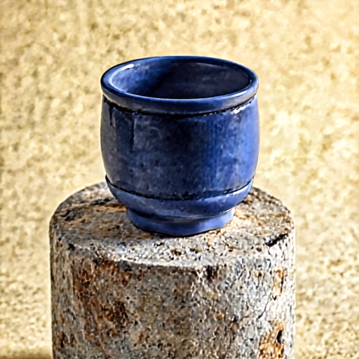
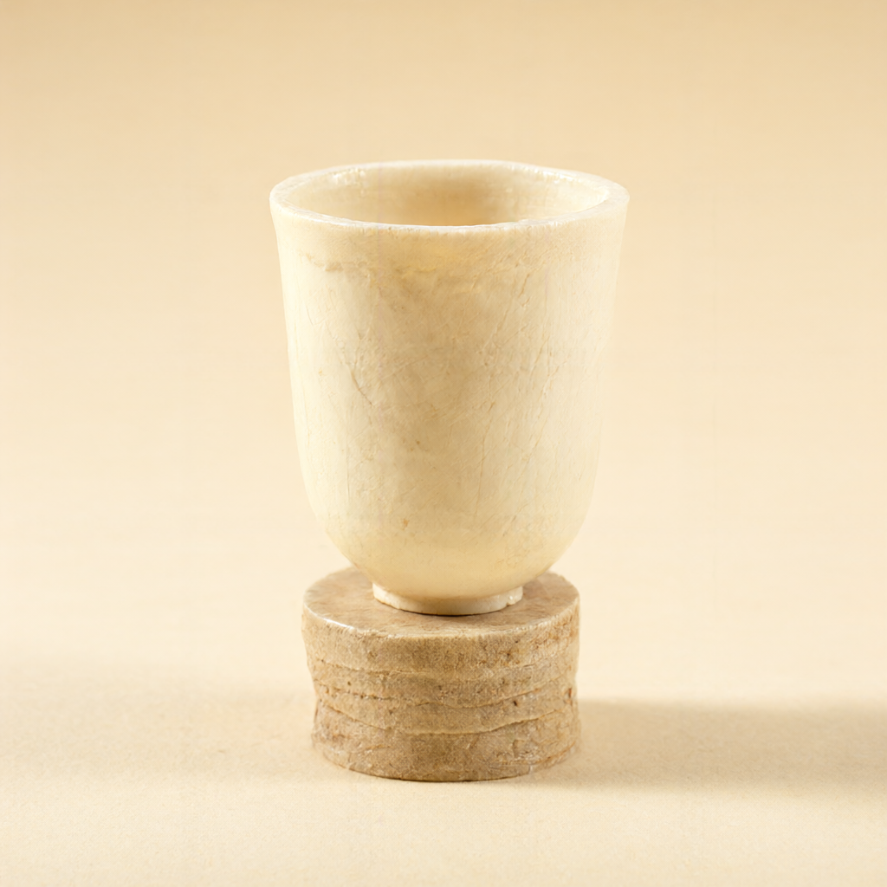

# Visual engineering checks

All images below are actual model outputs with generic prompts. These examples do not establish general quality equivalence. Full settings and limitations: [performance](../performance.md) and [small Macs](../small-macs.md).

## INT8 Fast mode

| Case | Normal | Fast |
|---|---|---|
| text |  |  |
| portrait |  |  |
| rgba |  |  |
| edit |  |  |

## Sequential q4 RGB probe

Not the production app backend. Both 512² and 1024² cup probes completed below a 6 GiB process budget on an M3 Ultra with 512 GiB RAM. Small-Mac hardware is not emulated.

